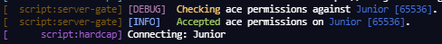
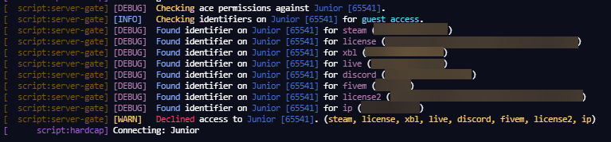

# fivem-server-gate

A simple resource to handle player access to your server. No database dependency, no code or config bullshit.

This is considered as a standalone resource, any integration to a database is to be done on your own terms - but I welcome the discussion of said integration in issues or discussions.





## Credit

Original credit for the main architecture goes to [Universal-Whitelist](https://github.com/InfImpSolutions/FiveM---Universal-Whitelist) from 3 years ago, at the time of writing this. The primary reason for making this resource, was due to not having universal support of all identifiers, and other providers had preconfigured delays without configuration.

> Should you encounter the problem of finding the 'FiveM HEX' of a Steam user, I think [Steam ID Pro](https://steamid.pro/) covers most of your concerns there.

## License

This resource is licensed under [AGPL-3.0](LICENSE), original [Credit](#Credit) to InflmpSolutions for the base structure.

You are more than welcome to learn from it for your own scripts or contribute to it through a pull request.

## Configuration

- `Guests`: A list of [indiviudals](#identifier-format) to allow access to the server *if `AllowGuests` is **`true`**.*
- `Messages`: A key-value map of messages to send to the console when a specific [event](#message-events) occurs.

### Options

- `AllowAce: string`: The ace permission to grant users access before attempting to look at the guest list.
- `AllowGuests: boolean`: Whether or not to allow guest access.
- `LogLevel: "DEBUG" | "INFO" | "WARN" | "ERROR" | nil`: The log level of this resource, provided default is `"INFO"` - set to `nil` to disable.
- `LogColors: {[keyof LogLevel]: number}`: a key-value map of [log format colors (cfx.re)](https://forum.cfx.re/t/chat-formatting-colors-bold-underline/67641) (1 to 9)

## Identifier Format

This resource accepts any identifier provided to it via the joining player. This includes, but is not likely limited to: `steam`, `license`, `xb1`, `live`, `discord`, `fivem`, `ip`. Their exact meaning or format is irrelevent to how this resource runs - just as long as you have the correct identifiers connected before joining (*user identifiers are printed upon joining when configured for `DEBUG` log level*).

### Known identifiers

- `steam:1234567890abcdef` - Hexadecimal, all lowercase characters
- `license:1234567890abcdef1234567890abcdef` - Hexadecimal, all lowercase characters (player may also have `license2:*`)
- `discord:12345678901234567890` - Numeric integer
- `xbl:12345678901234567890` - Numeric integer
- `live:12345678901234567890` - Numeric integer
- `fivem:1234567890` - Numeric integer, your [`forum.cfx.re`](https://forum.cfx.re) id
- `ip:127.0.0.1` - [Connecting address](https://en.wikipedia.org/wiki/IP_address)

> These are the same identifiers you would provide to the `add_ace` or `add_principal` config command (see [access control commands (FiveM Docs)](https://docs.fivem.net/docs/server-manual/server-commands/#access-control-commands)).

## Message Events

| Event | Log Level | Arguments | Description |
| ----- | --------- | --------- | ----------- |
| AceCheck | Debug | name, source | When attempting to check the connecting player's ace permissions against the provided node. |
| AceAccept | Info | name, source | Player is authorized to enter through use of ace permissions, guest list is skipped. |
| GuestCheck | Info | name, source | Checking connecting player against provided guest list. |
| GuestIdentifier | Debug | name, source, service, identifier | Found an `identifier` for `service`, useful if you wish to add them to the guest list and then reload the resource. |
| GuestAccept | Info | name, source, service | User is authorized to enter through use of the guest list. |
| DeclineLog | Warn | name, source, types(, ) | User is declined entry to this server, no identifiers or permissions were found to match. |

### Additional notes

- Arguments are provided as is, and cannot be adjusted at this time without modifying the script.
  - 'assessments' on what information is considered at each log level has been extremely brief, but of what is certain - `identifier`s will only be accessable when log level is **Debug**, this is done so as to ensure user privacy of any identities to their account and any logs that may be found on your system.
- Log Levels are of a structure similar to an incremental enum, setting log level to `WARN` will only print those messages and above (which includes `ERROR`... if there were any).
- Yes, the code probably still isn't as optimized as you would expect (i.e. local variable declartion for `source` to something like `player` for Lua to pick it up 'faster') - but similarly I would prefer this to be used to help others learn the importance of knowing when variable is necessary (rather than sticking by the *tradition* of the community as a code standard / convention).

> **Maximum time complexity for each joining player** - `O(n * l)`
> 
> - `n` refers to the number of entries on the guest list (if guests are allowed).
> - `l` refers to the number of identifiers the connecting user has.
> - Plus the additional operation to ace check the connecting user at the before all of it (considered neglable for current use cases).
> 
> While the rate of execution for this resource is relatively fast, time taken increases both with number of entries on the guest list and number of identifiers on the connecting user. Even in the slightest chance, please bare this in mind if it is taking longer to kick an unauthorized user.

## Known Root 'Problem'

If you are the owner of the license key to the server you are joining, it is likely that if the `group.admin` principal is associated with whatever `AllowAce` is set to, you will join regardless of the configuration or permissions assigned to you (whether you want it or not). If this is intentional by CitizenFX, you (as the license key holder) cannot *lend* a server key to someone else with this ace associated with the group and still be refused access - please consider using different group names or modifying the script to fit your needs.

```
# where `AllowAce` is configured as 'servergate'

# test 1 - owner should join
add_ace group.admin servergate allow

# test 2 - owner should join
add_ace group.mod servergate allow
add_principal group.admin group.mod
```
